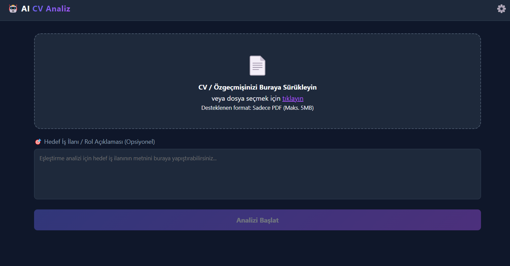

# 🤖 AI CV Analyzer & ATS Optimizer

### AI-powered desktop application for resume analysis and ATS-focused improvement suggestions.

**AI CV Analyzer & ATS Optimizer** is a desktop application that analyzes PDF resumes using Google Gemini API.
Users can upload a CV, optionally enter a target job description, and receive structured feedback about resume quality, strengths, weaknesses, and ATS compatibility.

---

## 🎯 Problem Definition

Many candidates prepare resumes without knowing whether their CV is suitable for a specific role or compatible with ATS systems.

Common problems include:

* Missing technical keywords
* Weak project descriptions
* Lack of measurable achievements
* Poor job-description alignment
* Low ATS compatibility

This project aims to provide fast, clear, and AI-powered feedback before applying for jobs.

---

## 💡 Solution

The application helps users improve their resumes through an AI-based analysis workflow.

It can:

* Extract text from PDF resumes
* Analyze CV content with Gemini
* Compare the CV with an optional job description
* Generate ATS-focused feedback
* Provide practical improvement suggestions

---

## 🖥️ Why Electron?

Electron was used to make the project easier to use as a desktop application.

It allows the interface to be built with HTML, CSS, and JavaScript while still providing a desktop-like experience.

In this project, Electron handles:

* User interface
* PDF upload screen
* Settings panel
* API key input/reset
* Communication with the Python backend

---

## 🔄 How It Works

```text
PDF Resume
   ↓
Text Extraction
   ↓
Gemini AI Analysis
   ↓
ATS-Focused Feedback
```

The user uploads a PDF CV, the backend extracts the text, Gemini analyzes the content, and the result is displayed inside the desktop application.

---

## 🖼️ Application Preview

<p align="center">
  
</p>

<p align="center">
  <i>Main screen of the AI CV Analyzer desktop application.</i>
</p>

---

## ✨ Features

* 📄 PDF resume upload
* 🧾 Automatic text extraction
* 🎯 Optional job description input
* 🤖 Gemini-powered CV analysis
* 📊 ATS-focused evaluation
* 🌟 Strength detection
* ⚠️ Weakness and gap detection
* 💡 Improvement suggestions
* 🔑 User-provided API key
* 🔄 API key reset option
* 🖥️ Electron desktop interface
* 🐍 Local Python FastAPI backend

---

## 🛠️ Technologies Used

| Technology              | Purpose             |
| ----------------------- | ------------------- |
| Electron                | Desktop interface   |
| HTML / CSS / JavaScript | Frontend            |
| Python                  | Backend             |
| FastAPI                 | Local API service   |
| Uvicorn                 | Backend server      |
| pypdf                   | PDF text extraction |
| Google GenAI SDK        | Gemini integration  |
| electron-store          | Local key storage   |

---

## ⚙️ Installation

Clone the repository:

```bash
git clone https://github.com/your-username/ai-cv-analyzer.git
cd ai-cv-analyzer
```

Install Node.js dependencies:

```bash
npm install
```

Install Python dependencies:

```bash
python -m pip install -r src/backend/requirements.txt
```

Run the application:

```bash
npm run start
```

---

## 🔑 API Key

This project uses a **Bring Your Own Key** approach.

The Gemini API key is not included in the source code.
Users enter their own key from the settings panel and can reset it anytime.

---


## 🎥 Demo

<p align="center">
  <a href="assets/demo.mp4">
    ▶️ Watch Demo Video
  </a>
</p>

<p align="center">
  <i>Click the link above to watch the application demo.</i>
</p>

---

## 🚀 Future Work

* PDF report export
* OCR support for scanned PDFs
* Resume rewriting suggestions
* Multi-language CV analysis

---

## 📌 Note

This repository includes the development version of the project.
Generated executable files, API keys, virtual environments, and build outputs are not included.

---

## 🌟 Final Note

This project combines Electron, Python FastAPI, PDF processing, and Gemini API to create a practical AI-powered resume analysis tool.
